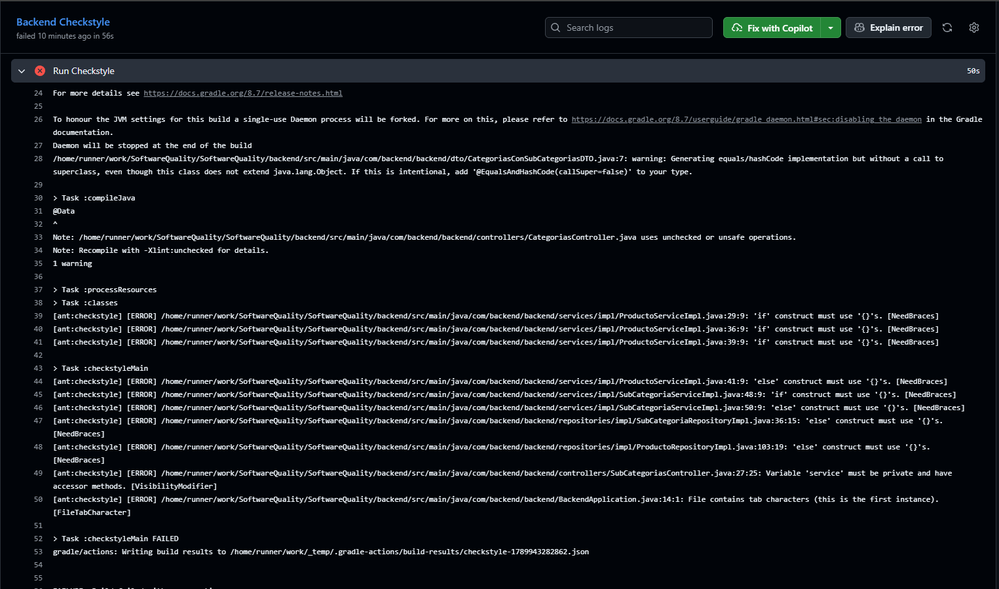

# TP1: Linter — Documento de trabajo

Este documento reúne la resolución progresiva del TP1 para el repositorio público del grupo. Se actualizará a medida que avance el trabajo y, al finalizar, se copiará en la Issue `TP1: Linter` junto con la evidencia correspondiente.

## Objetivo

Implementar herramientas de linteo adecuadas para los lenguajes utilizados en el repositorio y preparar un gate de calidad que, posteriormente, impida integrar una Pull Request cuando los controles definidos fallen. La entrega final también debe documentar el workflow, el área de calidad relacionada con ISO 25000 y las capturas de evidencia.

## Alcance y fundamento de la decisión

El repositorio actual contiene:

- **Backend:** Java con Spring Boot.
- **Frontend:** JavaScript/JSX con React y Vite.

Por eso, las herramientas locales seleccionadas son:

| Área | Herramienta | Motivo |
|---|---|---|
| Java | Checkstyle | Controla convenciones y formato del código Java del backend. |
| JavaScript/JSX | ESLint | Analiza el código del frontend React y sus reglas asociadas. |

PMD y SpotBugs quedan fuera de la primera configuración enfocada, salvo que una decisión posterior justifique incorporarlos.

El alcance de la consigna también incluye crear un repositorio público, proteger `main`, requerir que los checks pasen antes del merge y documentar el Action como gate. Esas actividades son posteriores a la configuración y verificación local.

## Estado actual

- [x] TP1-2: crear y verificar la configuración local de Checkstyle para el backend.
- [ ] TP1-3: verificar y, si corresponde, completar la configuración local de ESLint para el frontend.
- [ ] TP1-4: ejecutar ambos linters y registrar la línea base y los hallazgos.
- [ ] TP1-5: completar este documento con el diseño del workflow, el análisis ISO 25000 y la evidencia.
- [x] TP1-6a: configurar localmente el workflow de Checkstyle; falta observar una ejecución remota.
- [ ] TP1-6b: configurar y verificar la protección remota de `main`.

**Importante:** el archivo del workflow ya está configurado en el repositorio, pero todavía no se afirma que GitHub Actions lo haya ejecutado. La protección de ramas y los requisitos de merge siguen sin configurarse.

## TP1-2: Checkstyle local del backend

### Rol seleccionado

Checkstyle funciona como una verificación estática local de convenciones y mantenibilidad del código Java. El plugin existente de Gradle conserva Checkstyle 10.12.5, `ignoreFailures = false` y `maxWarnings = 0`, por lo que cualquier incumplimiento reportado mantiene el comando en estado fallido.

### Configuración y comando

- Archivo: `backend/config/checkstyle/checkstyle.xml`
- Desde `backend/`: `./gradlew.bat checkstyleMain` (en PowerShell: `./gradlew.bat checkstyleMain`)
- El `build.gradle` ya apuntaba a esa ruta; no fue necesario cambiarlo.

### Reglas seleccionadas y fundamento

| Grupo | Reglas | Motivo |
|---|---|---|
| Longitud y caracteres | `LineLength` (120), `FileTabCharacter` | Mantener líneas legibles y archivos consistentes en UTF-8. |
| Imports | `AvoidStarImport`, `RedundantImport`, `UnusedImports`, `ImportOrder` | Hacer dependencias explícitas, ordenadas y sin entradas muertas. |
| Nombres | `PackageName`, `TypeName`, `MemberName`, `MethodName`, `ParameterName`, `LocalVariableName`, `ConstantName` | Hacer predecible el significado de tipos, miembros y variables. |
| Visibilidad | `VisibilityModifier` | Evitar declaraciones accidentales con visibilidad de paquete. |
| Estructura y formato | `NeedBraces`, reglas de llaves, reglas de espacios, `DeclarationOrder`, `ModifierOrder`, `EmptyBlock` | Clarificar flujo de control y reducir errores de lectura sin imponer una reescritura masiva. |
| Javadoc | No habilitado en esta línea base | El código existente no documenta sistemáticamente sus APIs; activarlo ahora produciría ruido no relacionado con TP1-2. |

### Resultado exacto de verificación

**Ejecutado correctamente con resultado fallido.** Desde `backend/` se ejecutó:

```powershell
.\gradlew.bat checkstyleMain
```

Checkstyle se ejecutó y encontró **10 errores en 6 archivos**, por lo que `:checkstyleMain` terminó con código distinto de cero. El gate debe conservar este comportamiento: las violaciones no se ocultan y el workflow debe fallar mientras existan.

Hallazgos registrados:

| Regla | Archivo o archivos afectados | Cantidad o descripción |
|---|---|---|
| `FileTabCharacter` | `BackendApplication.java` | Contiene caracteres de tabulación. |
| `VisibilityModifier` | `SubCategoriasController.java` | El campo `service` no es privado. |
| `NeedBraces` | `ProductoRepositoryImpl.java`, `SubCategoriaRepositoryImpl.java`, `ProductoServiceImpl.java`, `SubCategoriaServiceImpl.java` | Hay `if`/`else` sin llaves. |

Además, la compilación mostró una advertencia de Lombok sobre `@EqualsAndHashCode` en `CategoriasConSubCategoriasDTO.java` y una nota sobre operaciones no verificadas en `CategoriasController.java`. Esas advertencias no corresponden a Checkstyle y quedan separadas de los 10 errores del linter.

No se ejecutó la suite de pruebas ni se corrigieron los hallazgos. Se revisarán y corregirán en una etapa posterior, después de completar la configuración de ambos linters.

### Corrección de la línea base

Luego de registrar la evidencia del fallo, se corrigieron las 10 violaciones de Checkstyle sin modificar la lógica funcional:

- Se reemplazaron tabs por espacios en `BackendApplication.java`.
- Se normalizó la inyección de dependencias en `SubCategoriasController.java` mediante campos privados finales y constructor.
- Se agregaron llaves a las estructuras `if` y `else` señaladas por Checkstyle.

La ejecución remota fallida utilizada como línea base está disponible en:

<https://github.com/SoftwareQualityUnc/SoftwareQuality/actions/runs/35541760139>

También se conserva la captura `TPs/TP1-Linter/assets/checkstyle-fail.png` como evidencia visual.


Con Java 17, la verificación local posterior se ejecutó desde `backend/` con:

```powershell
.\gradlew.bat checkstyleMain --no-daemon
```

Resultado: `BUILD SUCCESSFUL`. La compilación todavía informa una advertencia independiente de Lombok y una nota sobre operaciones no verificadas; ninguna corresponde a una violación de Checkstyle.

## Pasos locales planificados

1. Configurar Checkstyle en el módulo `backend/`, conservando una configuración reproducible mediante el Gradle Wrapper.
2. Verificar la configuración existente de ESLint en `frontend/` y ajustarla solo si es necesario para JavaScript/JSX.
3. Ejecutar los comandos locales de cada herramienta, sin mezclarlos con la suite de pruebas.
4. Registrar comandos, versiones, resultado de ejecución, advertencias y decisiones de la línea base.
5. Revisar los hallazgos y dejar el backend y el frontend en un estado que permita automatizar el control.

Los comandos exactos se confirmarán después de completar cada configuración; por ahora, la ejecución y sus resultados están pendientes.

## Gate de GitHub Actions

### Configuración local del workflow

El workflow está en `.github/workflows/quality-gate.yml`, que es la ubicación que GitHub reconoce para workflows del repositorio. En este primer paso contiene únicamente el job de Checkstyle del backend:

- Cualquier push, independientemente de la rama.
- Pull requests cuyo destino es `main` o `develop`.
- Permiso mínimo `contents: read`.
- Java 17 Temurin mediante `actions/setup-java@v4`.
- Gradle mediante `gradle/actions/setup-gradle@v4`.
- Comando exacto: `./gradlew checkstyleMain --no-daemon`, ejecutado con `working-directory: backend`.
- Job Summary con cantidad de archivos y violaciones detectadas.
- Artifact `checkstyle-reports` con los reportes HTML y XML de Gradle, incluso cuando el linter falla.

El comando no usa `continue-on-error` ni oculta violaciones: una salida distinta de cero hace fallar naturalmente el job.

### Evidencia y límites de esta etapa

La primera ejecución remota confirmó el runner Ubuntu, Java 17 y Gradle, pero falló antes de ejecutar Checkstyle con `Permission denied` porque el wrapper `backend/gradlew` no tenía permiso de ejecución en Linux. El workflow incorpora ahora un paso `chmod +x gradlew` antes de invocarlo. Además, el workflow genera un resumen visible y conserva los reportes como artifact mediante pasos `if: always()`.

La configuración del workflow y la ejecución remota son evidencias distintas: el archivo local demuestra qué se solicitará a GitHub, mientras que una ejecución del Action produciría la evidencia remota. La protección de ramas todavía no existe como parte de esta tarea.

También queda pendiente verificar la protección de `main`, el bloqueo de commits directos y el requisito de checks exitosos. No se afirma que ninguna de estas configuraciones remotas exista actualmente.

## Análisis ISO 25000

**Pendiente.** Se documentará qué características y subcaracterísticas de calidad de ISO 25000 se relacionan con el uso de linters, especialmente mantenibilidad y sus aspectos aplicables al código fuente. El análisis final deberá distinguir entre la detección estática de incumplimientos y otras actividades de calidad, como pruebas funcionales o seguridad.

## Evidencia

**Pendiente.** Se incorporarán capturas o referencias verificables de:

- ejecución local exitosa o fallida de Checkstyle;
- ejecución remota fallida de la línea base: [Quality Gate run 35541760139](https://github.com/SoftwareQualityUnc/SoftwareQuality/actions/runs/35541760139);
- captura visual de la línea base: `assets/checkstyle-fail.png`;
- ejecución local exitosa o fallida de ESLint;
- workflow de GitHub Actions ejecutándose como gate;
- protección de la rama `main` y restricciones de merge.

No se presentan capturas ni resultados como si ya hubieran sido verificados.

## Checklist de entrega

- [x] Configurar y verificar Checkstyle localmente.
- [ ] Verificar y, si corresponde, ajustar ESLint localmente.
- [ ] Ejecutar ambos linters y registrar resultados.
- [x] Crear el workflow de GitHub Actions para el job inicial de Checkstyle.
- [ ] Verificar que el Action bloquee el merge cuando falle el linteo.
- [ ] Configurar y verificar la protección de `main`.
- [ ] Completar el análisis ISO 25000.
- [ ] Adjuntar la evidencia requerida.
- [ ] Copiar la versión final en la Issue `TP1: Linter` y asociar la Pull Request con `Closes #<número>`.

## Próximo paso

Mantener registrados los 10 hallazgos de Checkstyle sin corregirlos todavía. El próximo bloque es verificar la configuración local de ESLint para React y luego ampliar el workflow para que el gate controle ambos módulos.
